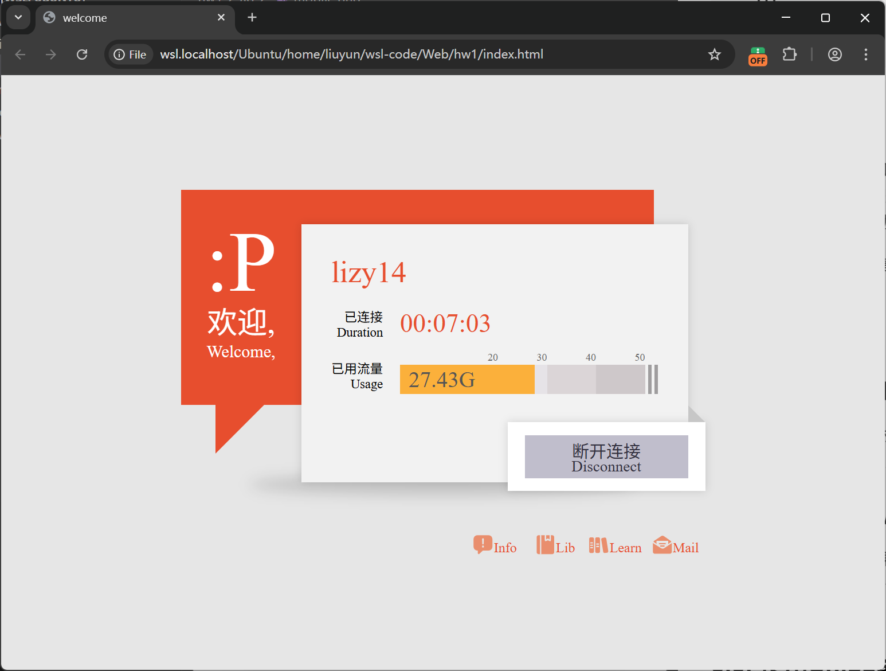
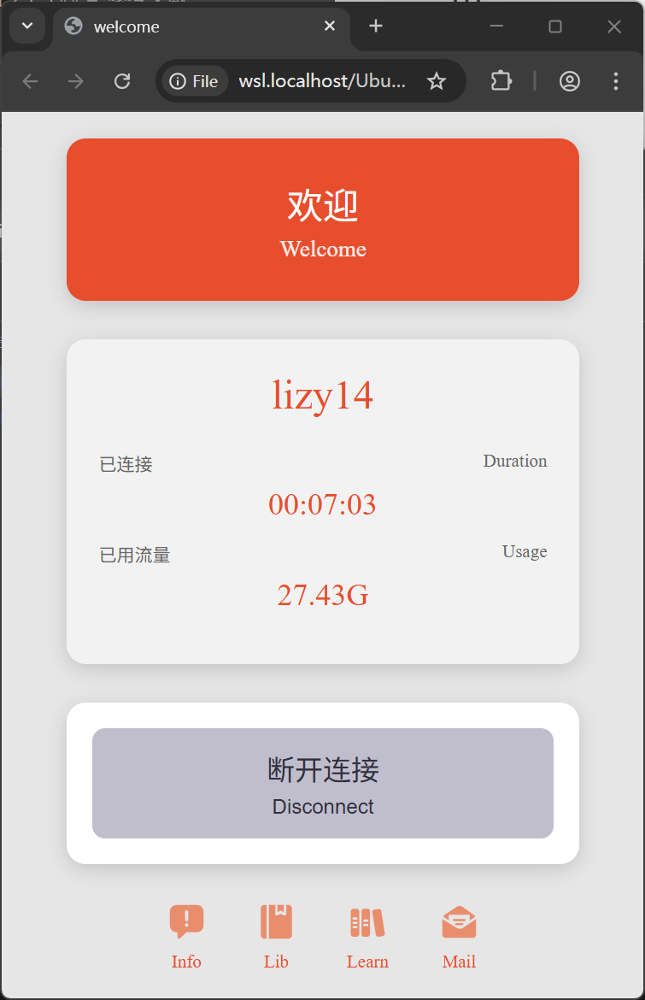

# 基础实验1报告
生11 刘云 2021011932 liuyun_2002@outlook.com

## 1. 实现思路
由于原本图案过于复杂, 因此在此并没有将原有图案设计为可动态调整大小的组件, 而是直接设定固定像素大小. 同时使用响应式布局, 当窗口宽度较小时, 会自动切换到全新的移动端布局.





桌面端图形可以分为上方的三个矩形堆叠区域, 以及下方的链接区域.

### 1.1. 矩形堆叠区域
页面渲染时, 对于一般的对象，会从文档开头至结尾顺次渲染, 因此仅需按照从底层向上层的顺序依次声明结构即可. 橙色对话框, 白色信息框, 断开连接框分别对应三个`div`. 后两者均使用绝对定位实现堆叠效果.

对于底部橙色对话框, 本次实验由橙色的矩形`div`和通过长宽为0, 具有一个橙色边框的`div`实现的三角形共同组成. 对于三角形部分, 声明具有四个边框的`div`并且有一边上色, 即可生成底边与x或y轴平行等腰直角三角形. 为了实现对话框中倾斜的三角形, 还需要使用`transform`属性中的`rotate`函数旋转.

在对话框下方有一个椭圆的阴影区域. 由于阴影离对话框较远, 因此单独绘制, 而不使用`box-shadow`属性. 通过绝对定位绘制边缘模糊的矩形来实现阴影.

对于对话框中的文本信息, 由于固定了不同区域的像素大小, 因此可以方便地计算出文本区域的高度和宽度.

断开连接框右上角的三角形实现选择使用csv方式声明. 不使用`div`边框的方式定义, 是因为此处三角形仍需通过旋转的方式绘制, 并且需要位移中心点根号2个距离, 难以精确计算(当然可以通过切换旋转中心的方式解决这个问题).

由于后两个区域使用了绝对定位的方式, 因此父级容器无法直接计算整个区域大小, 因而无法正确在页面中居中对齐. 但是由于每个区域的像素大小都是固定的, 因此可以人工计算整体区域大小, 硬编码进整个矩形堆叠区的父容器的大小, 使得父容器可以刚好包裹整体图案.


### 1.2. 链接区域
链接区域为简单的横向排布的`flex`布局. 区域中的图标来自iconfont中的csv图标. 使用csv图标可以方便的修改颜色及无损修改大小.


### 1.3. 移动端视图
由于矩形堆叠区域的大小固定, 因此当视窗大小小于区域大小时, 仅需滑动滚动条即可查看全部图案, 并不会导致原本图案的变形.

但是为了优化移动端的显示, 在此针对移动端单独设计了移动端布局. 由于移动端布局和桌面端布局差别较大, 本作业中直接在`body`中声明了两个`div`, 分别放置桌面端布局和移动端布局, 根据当前分辨率自动选择应该显示和隐藏的布局.

```html
<head>
  <style>
    @media screen and (max-width: 768px) {
      .desktop-layout {
        display: none;
      }
      .mobile-layout {
        display: flex;
      }
    }
    ...
  </style>
</head>

<body>
  <div class="desktop-layout">
    ...
  </div>

  <div class="mobile-layout">
    ...
  </div>
</body>
```


## 2. 使用说明
本实验仅使用了HTML和CSS, 并且编写在同一文件中. 因此打开本作业中的HTML文件即可显示网页. 通过调整浏览器尺寸, 当横向尺寸缩小到768px后(常用平板的响应式布局边界尺寸), 会自动切换到移动端视图.

## 3. 实验心得

### 3.1. 由边框绘制的三角形
只有当四个边框均声明时, 图形的中心才在显示出的三角形的顶点, 即原本矩形的中心点. 否则旋转中心会发生偏移, 此时以中心旋转时, 并不是以顶点旋转.

### 3.2. Flex布局下居中溢出截断
在声明了flex布局后, 如果视窗大小较小, 会发生内容溢出. 此时滑动滚动条可以看到位于尾部的完整内容, 但是头部的内容会被截断. 根据参考文献中的经验, 对子元素使用`margin: auto`样式, 可以解决这个问题.

### 3.3. 使用Snipaste比对布局实现
感谢软件32的王雪松同学的经验, 可以使用Snipaste免费版软件的截图和半透明悬窗功能, 将目标样式和当前实现的样式进行堆叠比对, 可以直观的看到差异.

## 4. 参考资料
图标来源: https://www.iconfont.cn/collections/detail?spm=a313x.collections_index.i1.d9df05512.76093a81C3V1W5&cid=52203
Flex布局溢出解决方案: https://zhuanlan.zhihu.com/p/670868851
移动端布局的初步设计由Claude Sonnet 4生成, 后经人工检查和大量修改.