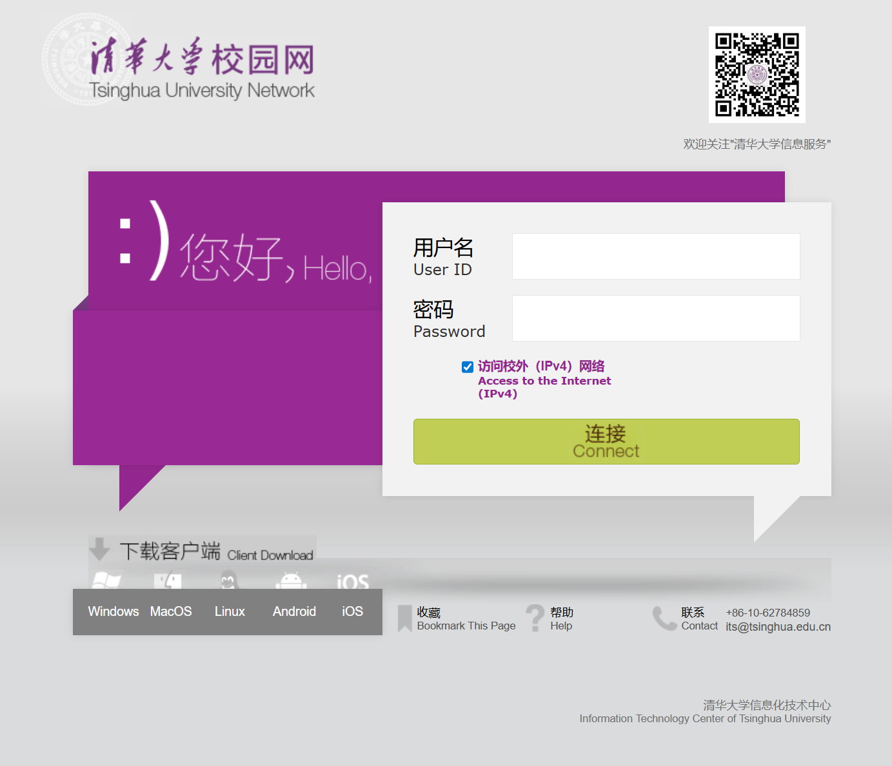
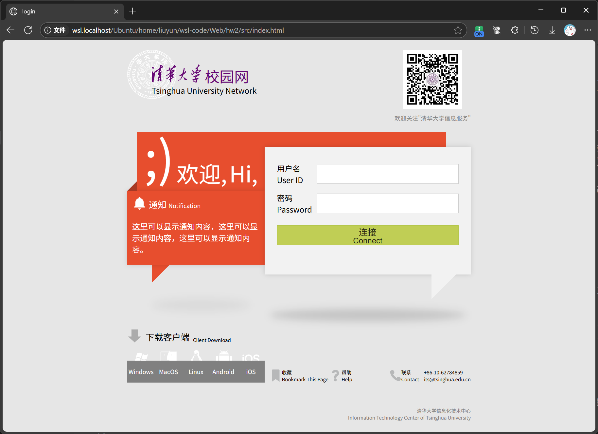
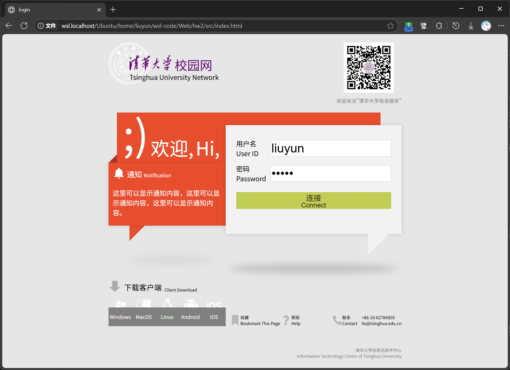
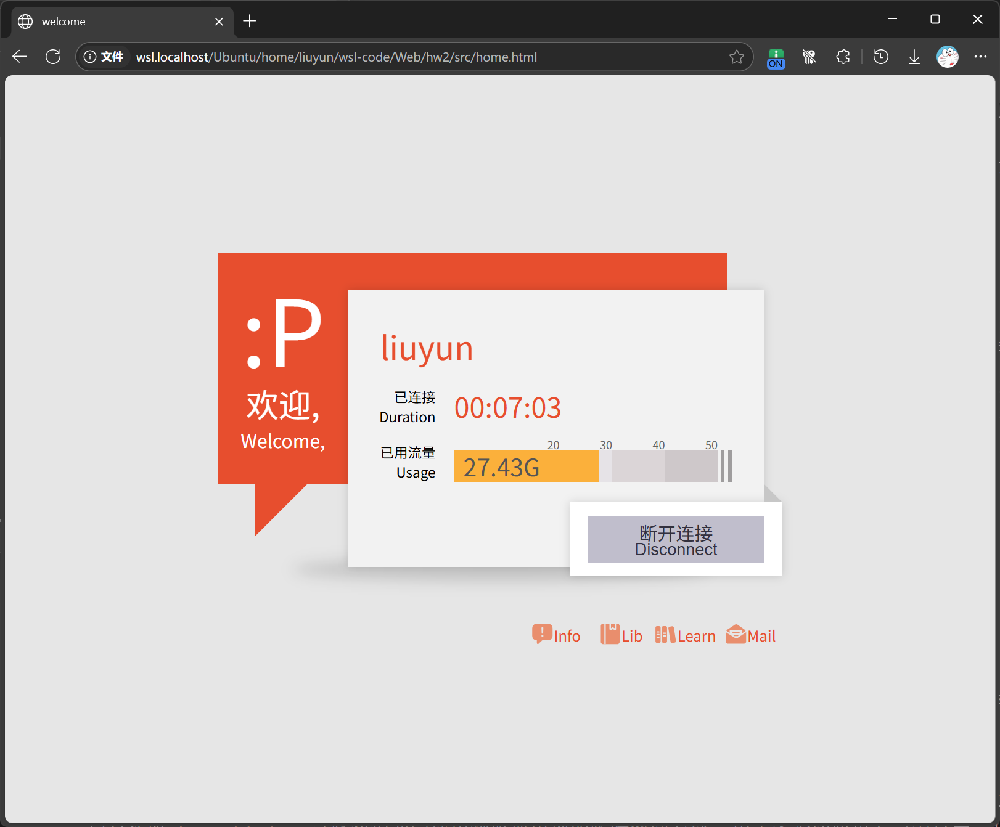
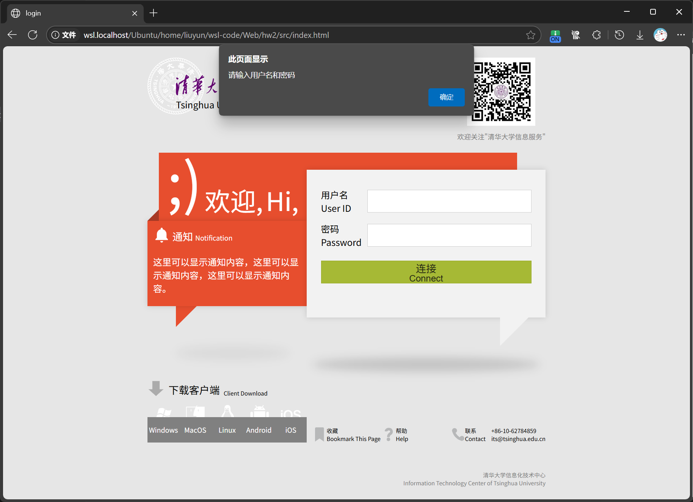

# 基础实验2报告
生11 刘云 2021011932 liuyun_2002@outlook.com

## 1. 实现思路

### 1.1. 登陆页面设计

登陆页面基于新版页面元素设计, 配色参考老版页面.

下图为新版登陆页面

下图为本次实验实现

页面核心的对话框堆叠布局在实验1基础上稍加修改.

在实际的校园网登陆页面中, 校园网logo和下载客户端部分的图形为图像, 并且不具有透明背景, 可以明显看出图像边缘. 因此在本次实验中, 除二维码外, 并未使用实际网页中其他任何图像资源. 原本图像的位置均替换为类似的svg形式. 二维码资源存放在`index.html`文件同目录下的`images`目录下.

### 1.2. 跳转实现

登陆页面为`index.html`, 登录成功页面为`home.html`.

在`index.html`中使用JavaScript编写`Login()`函数, 并且通过`onclick`属性绑定在连接按钮上. 当点击后, 读取被分配对应id的用户名和密码输入框中的内容, 存储进浏览器本地的`sessionStorage`中作为页面传递数据的容器. 随后通过`location.href`将页面切换到`home.html`.

在`home.html`中, 读取`sessionStorage`中用户名对应的值, 并动态修改`home.html`页面中所有需要填充用户名的地方(桌面端和移动端的用户名框均需动态填充). 为了保证按id索引的正确性, 将动态赋值的过程通过`addEventListener`函数, 绑定到`DOMContentLoaded`事件后, 保证HTML页面构建完成后, 再按照id索引元素.

对于登出过程, 在`home.html`中编写`Logout()`函数, 清除`sessionStorage`中的用户名和密码元素, 并且跳转回`index.html`.

## 2. 使用说明

在登陆页面输入用户名和密码后, 点击登陆即可跳转到登录成功页面, 并且在页面上显示刚刚输入的用户名. 

当用户名或密码任何一个为空时, 会弹出提示框提醒用户输入对应内容.

在登陆成功页面点击断开连接后, 会自动跳转回登陆页面.

## 3. 实验心得

### 3.1. 提取svg
可以通过Illustrator打开清华提供的logo pdf文件. 可以选取特定的部分, 并且导出成svg文件. 将svg文件中的内容拷贝到页面中即可显示复杂的清华logo. 但是复杂logo的svg代码一般较大. svg标签内部可能存在style标签, 这些标签的作用域是当前的svg环境.

### 3.2. 页面数据传递
通常情况下, `index.html`登陆页面需要将用户输入的内容发送到后端服务器验证, 随后后端服务器再将页面需要显示的信息传给`home.html`. 这些数据通常使用浏览器内部的临时空间存储. 由于本次实验仅有前端页面, 因此在两个页面传递信息时使用`sessionStorage`传递. 其中存储的信息仅在当前标签页有效.

另外也可以通过在URL中直接编写用户名, 用于在两个页面中传递用户名信息. 但是考虑到后续实验需要传输如密码等更复杂的信息, 而URL仅适合传递适合明文的字符串信息, 因此本实验使用`sessionStorage`传递数据.

## 4. 参考资料
图标来源: https://www.iconfont.cn
清华标志来源: http://oldinfo.tsinghua.edu.cn/html/xxxczl/xbhs.htm?v=1
svg和sessionStorage部分参考GPT-4.1