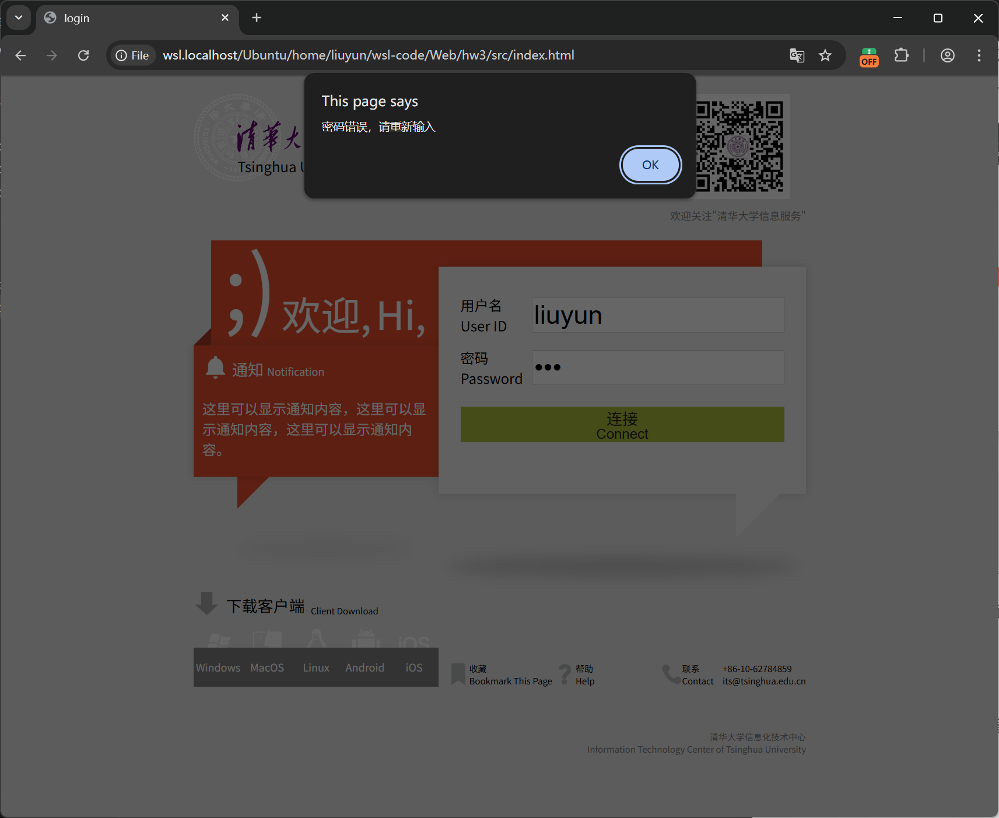

# 基础实验3报告
生11 刘云 2021011932 liuyun_2002@outlook.com

## 1. 实现思路

### 1.1. 用户名密码记录与验证
在真实场景下, 用户名和密码等信息会可靠存储在服务器中, 前端页面发送用户输入的信息至后端, 后端验证后发送结果给前端页面.

由于本次实验没有后端, 因此选择使用`localStorage`在浏览器本地长期存储用户名和密码信息, 模拟后端数据库. 首先本实验定义了用户信息的数据格式:

```javascript
userCredentials = {
  "userid": {
    password: "password",
    totalUsage: 27.43,  // 用户累计流量使用量(单位: G)
  },
  ...
}
```

由于`localStorage`只能存储字符串信息. 因此本实验使用json形式将用户信息转化成字符串形式记录.

在登陆的`index.html`页面中, 首先读取`localStorage`中存储的用户json信息, 检验用户名是否存在. 若存在, 则验证密码是否一致. 若不存在, 则添加用户信息, 并初始化流量累计用量信息.

当成功登录后, 使用实验2中的`sessionStorage`临时传递用户名信息和当前时间给登录成功页面`home.html`.

### 1.2. 已连接时间自增

在页面跳转到`home.html`时, 同时传入了登陆成功的时间. 通过开启定时器, 每秒钟计算距离登陆成功时间的差, 并格式化成字符串, 实时更新连接时间元素的内容.

```javascript
function startConnectionTimer() {
    connectionTimer = setInterval(function() {
        const currentTime = Date.now();
        const elapsedSeconds = Math.floor((currentTime - startTime) / 1000);
        
        const hours = Math.floor(elapsedSeconds / 3600).toString().padStart(2, '0');
        const minutes = Math.floor((elapsedSeconds % 3600) / 60).toString().padStart(2, '0');
        const seconds = (elapsedSeconds % 60).toString().padStart(2, '0');
        
        const timeString = `${hours}:${minutes}:${seconds}`;
        
        document.getElementById("duration").textContent = timeString;
        document.getElementById("mobile-duration").textContent = timeString;

        ...
    }, 1000);
}
```

### 1.3. 已用流量自增与记录

真实场景下流量记录应该在后端完成, 在此为了简便模拟, 使用连接时间的计时器模拟后端的每秒钟流量统计.

在进入登陆成功页面`home.html`后, 首先从`localStorage`中获取用户的`totalUsage`作为登陆时的历史用量. 随后开辟变量每秒钟自增3.33G, 并设置上限50G. 每秒自增后, 与登陆时的历史用量求和, 实时写入`localStorage`中. 需要注意此处并没有考虑并发问题, 当多个用户同时登陆时, 数据会存在覆盖问题.

按照要求, 用户界面并不会每秒更新流量用量. 但是`localStorage`中会实时记录每秒新增的用量, 用于模拟真实情况下后端实时的数据更新. 当用户断开连接并重新登陆后, `localStorage`中的`totalUsage`便是实时更新后, 上次断开连接时的最新用量.

在进入`home.html`显示流量时, 进度条的长度通过CSS中的变量`used-traffic`控制. 而进度条中的读数为`<p>`元素. 因此需要使用不同的JavaScript语句来更新显示内容.

```javascript
// 更新进度条
document.documentElement.style.setProperty('--used-traffic', startTotalUsage.toFixed(2));
// 更新显示数字
document.getElementById("traffic-number").textContent = `${startTotalUsage.toFixed(2)}G`;
document.getElementById("mobile-traffic-number").textContent = `${startTotalUsage.toFixed(2)} G`;
```

本实验设计时已考虑当总流量超过50G时, 进度条不会溢出.

```css
.progress-fill {
    width: min(calc(var(--used-traffic) / var(--max-traffic) * 100%), 100%);
    background-color: #fbb03b;
    ...
}
```

## 2. 使用说明

输入用户名和密码. 若是第一次登录, 则网页会在本地记录用户名和密码信息, 并自动跳转登录成功页面. 首次登录时, 已用流量为0G, 同时已连接时长从零开始累加.


点击断开连接会返回登陆页面. 如果再次登录已记录的用户, 当密码不匹配时, 会弹窗提醒.


当再次成功登录后, 已连接时长从零开始累加, 但已用流量为上次断连时计算的新的累计用量. 并且单次连接产生的用量不会超过50G, 但是可以通过多次连接使已用流量超过50G. 下图为多次成功连接后的结果.


## 3. 实验心得

### 3.1. 清理浏览器localStorage
在调试页面时, 通常需要清理已经存储的用户信息, 因此需要清理浏览器的`localStorage`. 对于Edge和Chrome浏览器, 可以在页面按`F12`, 并选择`应用程序`, 可以清空当前页面的存储信息.

### 3.2. localStorage和sessionStorage
`localStorage`和`sessionStorage`都是浏览器本地存储的形式. 其中`localStorage`主要用于本地永久化存储, 可以很好的模拟后端的数据库. `localStorage`通过协议, 主机名, 端口来区分不同存储区域, 用于隔离不同页面的本地存储. 对于使用本地文件直接打开的HTML页面(URL类似`file://file/path/home.html`), 似乎会共享同一个`localStorage`.

`sessionStorage`主要用于临时的数据存储, 通常在页面关闭后自动清理.

在未来实际部署页面时, 可以将`localStorage`部分替换成网络通讯协议, 来实现真正的用户登陆验证和信息获取过程. 另外本次实验中`localStorage`的密码使用明文记录, 在实际应用中非常不安全, 需要进行加密.

## 4. 参考资料
localStorage隔离: https://cloud.tencent.com/developer/article/1957822
json, 计时器和localStorage部分参考GPT-4.1